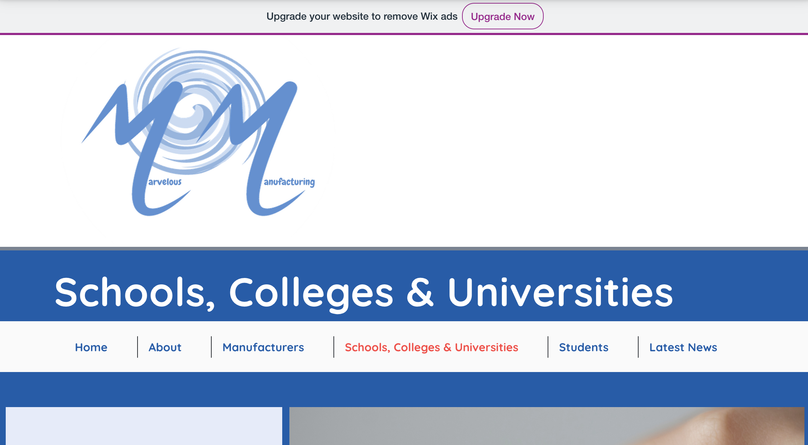

# Marvelous Manufacturing

<!-- MAIN IMAGE, place when responsive -->

Marvelous Manufacturing is a company created by Angela Lawlor, who aspires to connect young people with Manufacturing in the UK.

This web application has been completed using HTML, CSS & JavaScript. I have been working on this site and keeping in contact with thw business owner to ensure the end result is as required.

 

## Contents

- [UX](#ux)
  * [Project Goals](#project-goal)
  * [Wix issues](#wix-issues)
  * [User Stories](#user-stories)
  * [Design Choices](#design-choices)
  * [Q and A of Users](#q-and-a-of-users)
- [Project Setup](#project-setup)
  * [Prototype](#prototype)
  * [Complicated Features](#complicated-features)
  * [Features Left to Implement](#features-left-to-implement)
  * [Updating Website](#updating-website)
- [Testing](#testing)
  * [Fixed Bugs](#fixed-bugs)
  * [Unfixed Bugs](#unfixed-bugs)
  * [Responsive Design](#responsive-design)
- [Deployment](#deployment)
- [Credits](#credits)
  * [Code](#code)
  * [Web Tools](#web-tools)
  * [Media](#media)
  * [Acknowledgements](#acknowledgements)

## UX

### Project Goal

To create a website for Angela Lawlor from the prototype provided. This needs to be easy to navigate, contain links to exterior web pages, and needs a google maps api with markers.

| Goals                                                        | How are they achieved? |
| :----------------------------------------------------------- | :--------------------- |
| Create ease of access and navigation. | The navbar is consistent throughout the site. On the prototype, it did deviate and send to static pages with no way back, this has now been fixed. |
| Contain a map of manufacturing companies. | I have achieved this on the find-a-manufacturer.html page using the Google Maps API with API restrictions, and customized markers with different infoWindows and JavaScript functions to decorate them. |
| Make it possible for business owner to update map markers. | I have created a detailed guide for the business owner explaining how to do this. |
| Make it possible for business owner to update news collapsibles. | I have created a detailed guide for the business owner explaining how to do this. |
| Give links to email box with pre-entered data. | Using 'mailto', I was able to add a subject and body for the specific links on the services section. |

### Wix Issues

Wix.com is a tool used by many to create websites without needing the knowledge of code. Whilst this is great for small businesses needing to provide a prototype, it probably shouldn't be used on a live website without full knowledge and acceptance of its drawbacks.

1). The most obvious issue with this wix prototype was the website responsiveness. Not just on the live site, but the editor too. This created problems even when trying to locate specific elements using inspect on Chrome, as elements were constantly overlapping.

This issue meant elements were simply unclickable on mobile devices, damaging the entire website for small screen users.

2). The code was way too complicated. The loading time of every page was extensive, and it was clear to see why when trying to locate specific elements. At times, there would be a div within a div on multiple levels, when only one div was needed.

All of this above code results in a simple H2 element!

3). Moving elements was a struggle for Angela as Wixs' attempts to make things snap into place, also meant placing items next to or above/below one another was very difficult.

4). Load times were poor not just on the live site, but on the editor. This ties in with the complicated code issue but is also due to the images being way too large than needed. The videos I believe also took up too much memory on the page as they had no specific height and width properties.

### User Stories

#### Web User

- I should be able to travel from page to page and not lose track of where I am.
    - This is made possible using active classes in navigation bar, and testing that all links work.
- I should be able to click on a link and know it's taking me to another webpage, without losing my place.
    - This is made possible using the 'target' attribute on anchor elements and writing 'Visit URL' in the content.
- I should be able to click on a package and it pre-populate the email with the value I clicked on.
    - This is achieved using 'mailto' and entering '?subject=I %20 am %20 interested %20 in %20 your %20 VALUE %20 package'. The %20's represent a space in the text.

### Design Choices

The design choices had been made by Angela, but lacked consistency in places. This was due to the amount of content being displayed and the inability to easily move across the webpages.

#### Fonts

- The font has already been chosen by Angela, she liked the 'Quicksand' font. I loaded this into the first line of the CSS document and made it mandatory throughout the site.

#### Colours

- The dark blue and light blue was visible but in places there were grey and pink boxes added too. I decided to keep the website consistent to use the white, blue and lightblue wherever possible, with a few hints of a lightpink wherever Angela is mentioned.

- I also created buttons using the same colour scheme, which when hovered over alternated between the schemes colours.

#### Styling

- A lot of the materials and tools used in manufacturing are sharp and strong and I felt the sharp edges used in most of the site fitted this feel best, I made them consistent throughout.

#### Backgrounds & Images

- Some of the images are relative to the subject only. Some of these were decided by Angela, but weren't really effective on all devices, so I made them change to portrait images instead on Mobile.

<!-- Example of image change on small and large devices -->

- Some other images are images taken directly from the business or project being mentioned in the surrounding articles.

    
    

### Q and A of Users

I've asked the following questions to:

- <!-- List 3 customer's -->

#### Q1 - What did you make of the products on offer? Where there any items you'd expect that weren't there?

<!-- Person -->: 

- "<!-- Response -->"

#### Q2 - What makes a great website experience for you?

<!-- Person -->: 

- "<!-- Response -->"

#### Q3 - What other information might you need?

<!-- Person -->: 

- "<!-- Response -->"

#### Q4 - Would you use this site?

<!-- Person -->: 

- "<!-- Response -->"

#### Q5 - Why?

<!-- Person -->: 

- "<!-- Response -->"

#### Q6 - What changes could be made?

<!-- Person -->: 

- "<!-- Response -->"

#### Q7 - How did you find the navigation of the site? Was it as smooth as it should be or were there anomalies?

<!-- Person -->: 

- "<!-- Response -->"

## Project Setup

### Prototype

The prototype was a live Wix site.

As you can see from this image, the navbar is 3/4 of the way down the page, with the logo taking up most screen space. The wix advertisement is also visible, and taking up space.

The content was extensive and very well written, the page layouts were well put together and very informative. Some of the elements were working against each other due to the complications with Wix, but the amount of content given was more than enough to work with.

Whilst producing this updated version of the Marvelous Manufacturing website, I have been in talks with business owner Angela Lawlor, ensuring the original feel of the site and layout was still in her best interests.

## Features

### Complicated Features

#### <!-- Feature -->

- <!-- What and Why -->

<!-- Associated Images -->

### Features Left to Implement

- There are currently only two areas pages with content. Angela is yet to supply the content she wants within these pages so they are, for now, invisible.

- How is it made has two rows with content still to be decided too.

- There is a row on the metals area page for metal polishing, the content for this is still to be decided too.

### Updating Website

<!-- What have I put together -->

<!-- What can be done/changed? -->

<!-- Link -->

## Testing

You can view all testing in [this document.](https://github.com/ryanmcnally93/marvelous-manufacturing/blob/main/testing.md)

### Fixed Bugs

1). <!-- Bug -->

<!-- Image -->

<!-- Fix -->

### Unfixed Bugs

To my knowledge there are no current bugs. I have asked Angela to update me if this is not the case, and given her instruction on how to fix small errors herself.

### Responsive Design

#### <!-- Feature -->

- <!-- Action -->

<!-- Image -->

## Deployment

To deploy this latest project, 

1). First I travelled to the settings tab on my GitHub repository.
2). I then travelled to the pages branch.
3). I chose to deploy from the main /root, and clicked save.

This worked to get a static page on my site, I then had to add the find a manufacturer page to the allowed pages on my Google Maps API.

### Adding a custom domain

4). This was something I'd never done before. The client had purchased a URL from GoDaddy.com, but when I entered this into the custom domain section of GitHub pages, it did not pass the DNS checks.

I watched a YouTube video on how to solve this issue, asking the client to add DNS credentials 'A' '@' and the four IP addresses shown on GitHub Pages' documentation.

When I reloaded the GitHub pages page, the DNS checks passed and loading 'marvelousmanufacturing.co.uk' resulted in my page being shown.

5). I then updated the link on my repository description.
6). And made sure the deployed site's new 'find-a-manufacturer.html' URL was added to the Google Maps APIs' allowed webpages.

## Credits

### Code

- I used this Slack Overflow solution by [Jezen Thomas](https://stackoverflow.com/questions/18739937/how-to-keep-footer-at-bottom-of-screen) to produce a sticky footer that stays at the bottom of the page.

### Web Tools

- I used [Contrast Checker](https://webaim.org/resources/contrastchecker/) to make sure my headings were visible against their background colours.
- I used [Re-Sizing Images](https://www.simpleimageresizer.com/upload) to re-size images that were unnecessarily large.
- I used this [Webp Converter](https://ezgif.com/png-to-webp) to convert all images to webp format. I also used this site to crop images.
- And then I used this [Image Compresser](https://tinypng.com/) to make their file size smaller when necessary.

### Media

<!-- Use four tags for headings if this becomes too long -->
<!-- Give specific authors and websites -->

### Acknowledgements

- This website was incredibly easy to create due to the prototype created by the company owner Angela Lawlor. Despite her struggles using Wix, she had persisted and created a vast amount of pages with information, and put together a map with custom markers, having to teach herself how to do so along the way. It was very easy from this to visualise the result website Angela wanted.

This readme.md has been spellchecked using the spell checker extension for Chrome.

All documents within this repository have been formatted using "Prettier".
